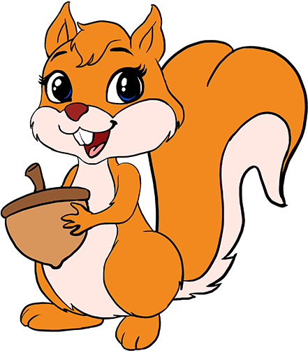

 

# What spirit animal would best fit Vidhi's personality? Why?
 
 <header>
 

   

   

   
 
   
   

   

 

 </header>

<box type="tip" header="Manjari and Aishu">
"Mouse - Has the face of one, keeps running around the corners, squeaking about and eating CHEESE!"  
</box>

 <header>
 

   

   

   
 
   
   

   

 

 </header>

<box type="tip" header="Juhi Di">
"Otter: cause Vidhi is warm and full of giggles ❤️"  
</box>
     
 
  <header>
  

    

    

    
  
    
    

    

  

  </header>
 
 <box type="tip" header="Kirthi">
 "Chihuahua; because small but loud, and also innocent and adorable."  
 </box>
  
   <header>
   

     

     

     
   
     
     

     

   

   </header>
  
  <box type="tip" header="Rutwik">
  "Frog, because it is small, jumps around a lot and is very loud."  
  </box>
   
   <header>
    

      

      

      
    
      
      

      

    

    </header>
   
   <box type="tip" header="Arushi and Atharva">
   "Monkey! Because she keeps jumping around, always steals food from people and is quick witted."  
   "A monkey perhaps due to the never ending energy that Vidhi has!!" 
   </box>

    
   <header>
     

       

       

       
     
       
       

       

     

     </header>
    
   <box type="tip" header="Vedisha">
    "Squirrel. Can't be sad seeing a squirrel at any time and a squirrel is never sad either."  
    </box>
  
   <header>
      

        

        

        
      
        
        

        

      

      </header>
     
   <box type="tip" header="Chunmun di and Simran">
     "Dog - playful at all times yet knows when to be sombre and very understanding."  
     "Because she is cute, she gets happy to see me and always loyal."  
   </box>
   
   <header>
         

           

           

           
         
           
           

           

         

         </header>
        
   <box type="tip" header="Maulik">
        "Quokkas as a spirit animal because they are always cheerful and happy."  
      </box>
      
   <header>
             

               

               

               
             
               
               

               

             

             </header>
            
   <box type="tip" header="Komal">
            "Giraffe. because I feel like a giraffe is an animal who just hangs, does what it’s supposed to, doesn’t get into drama and is v patient. - same thing I feel about vidhi. And I just checked they are very clever!! Same as Vidhu."  
          </box>
          
   <header>
                 

                   

                   

                   
                 
                   
                   

                   

                 

                 </header>
                
   <box type="tip" header="Nishkarsh">
                "I think the best spirit animal that fits her is, although cliched, a tiger, cause, well she's determined in life and has the drive to get what she wants. That's the perfect trait to have. "  
              </box>
        
   <header>
         

           

           

           
         
           
           

           

         

         </header>
        
   <box type="tip" header="Mom">
        "Horse is swift and does work assigned intelligently and is protective too"
    </box>
    
    
   <header>
                   

                     

                     

                     
                   
                     
                     

                     

                   

                   </header>
                  
  <box type="tip" header="Dad">
                  "Wolf. For its intelligence and instinct reaction."
       </box>
    
   <header>
                 

                   

                   

                   
                 
                   
                   

                   

                 

                 </header>
                
   <box type="tip" header="Tejas and Ayushi">
                "Grizzly bear cause is bubbly, hyperactive, loud, and talkative. enjoys attention and generally is very social and friendly."
            </box>
        
   <header>
             

               

               

               
             
               
               

               

             

             </header>
            
   <box type="tip" header="Ayushi">
            "Wise, determined and confident just like an OWL."
        </box>
        
   <header>
             

               

               

               
             
               
               

               

             

             </header>
            
   <box type="tip" header="Tejas">
            "Behaves like a just born chicken."
        </box>
        
        
    
   
   
   
      
