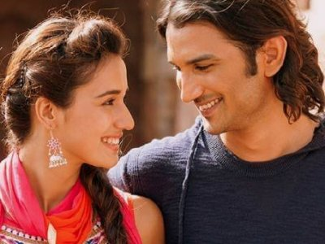

 

# What song would Vidhi sing in a karaoke night? 

  <header>
             

               

               

               
             
               
               

               

             

             </header>

<panel header="Manjari" type="info">
  "Diya aur baati,  
   Hum saath saath hain,  
   Janmon ke saathi,  
   Hum saath saath hain"
</panel>

  <header>
             

               

               

               
             
               
               

               

             

             </header>

<panel header="Chinki" type="info">
  "Kudi Nu Nachne De,  
   Haan Nachne De,  
   Tu Aaj Lagane De Thumke,  
   Haan Jamm Ke"
</panel>

  <header>
             

               

               

               
             
               
               

               

             

             </header>

<panel header="KP" type="info">
  "Oh dholi mein bhitake, sitrao se sajaa ke,  
  Zaamane se churake le jaye ga,  
  Saawariya.. hha hha haa, Saawariya.. hha hha haa,  
  Saawariya, ohhhh Saawariya".....  
  Until she bores us
</panel>

  <header>
             

               

               

               
             
               
               

               

             

             </header>

<panel header="Riya" type="info">
  "Enga Ooru Chennai-Ku  
  Periya Whistle Adinga…  
  Enga Thala Dhoni-Ku  
  Periya Whistle Adinga…"
</panel>

  <header>
             

               

               

               
             
               
               

               

             

             </header>

<panel header="Srishti" type="info">
  "Hai manjha tera tez,  
   Yeh dil ki patang ko kaate haaye,  
   Tujhi se kat ke yeh,  
   Gire teri chhat pe aake haaye"
</panel>

  <header>
             

               

               

               
             
               
               

               

             

             </header>

<panel header="Juhi di" type="info">
  "Chak de, O chak de India.."
</panel>

  <header>
             

               

               

               
             
               
               

               

             

             </header>

<panel header="Soumil" type="info">
  "Hawaa ke jaise chalta hai tu,  
   Main ret jaisi udti hoon,  
   Kaun tujhe yun pyar karega,  
   Jaise main karti hoon
</panel>

  <header>
             

               

               

               
             
               
               

               

             

             </header>

<panel header="Dad" type="info">
  "ऐड़े-पैड़े (दे घुमा के),  
   आरे-पारे (दे, दे घुमा के),  
   गुत्थी-गुत्थम (दे घुमा के),  
   अड़चन-खड़चन (दे, दे घुमा के)"
</panel>

  <header>
             

               

               

               
             
               
               

               

             

             </header>

<panel header="Mom" type="info">
 "ऐ मेरी ज़ोहरा ज़बीं,  
  तुझे मालूम नहीं,  
  तू अभी तक है हंसीं,  
  और मैं जवाँ,  
  तुझपे क़ुरबान मेरी जान मेरी जान"
</panel>

  <header>
             

               

               

               
             
               
               

               

             

             </header>

<panel header="USHI Gang" type="info">
  "Saathiya Mere,  
  Main To Tera Deewana Hoon,  
  Saare Jahaan Se Begaana Hoon,  
  Teri Dhuno Ka Tarana Hoon.."
</panel>

  <header>
             

               

               

               
             
               
               

               

             

             </header>

<panel header="Tejas" type="info">
  "Sun mere humsafar,  
   Kya tujhe itni si bhi khabar,  
   Ki teri saansein chalti jidhar,  
   Rahunga bas wahin umrr bhar,  
   Rahunga bas wahin umrr bhar"
</panel>

